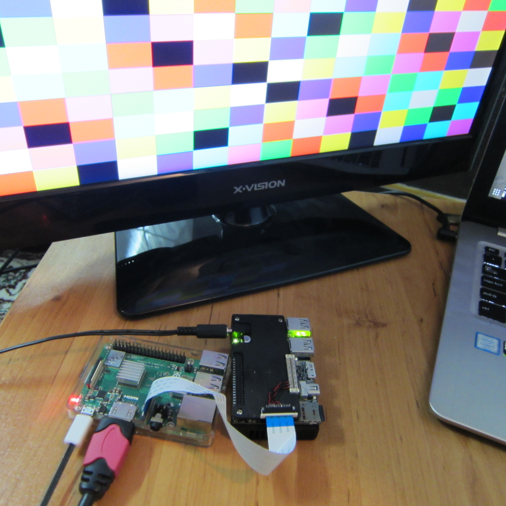

This is a modified version of the [raspiraw](https://github.com/Hermann-SW/fork-raspiraw/)
for capturing RGB24 CSI frames over the camera port. This application has been tested using
an [Ultra96v1](https://www.96boards.org/product/ultra96/) FPGA board as the traffic generator.
The details of this experiment will be posted soon on the hackster.io.

## Command Line Options

Table of contents:

	$ raspiraw

	raspiraw Camera App 0.0.1

	-?, --help	: This help information
	-md, --mode	: Set sensor mode <mode>
	-g, --gain	: Set the sensor gain code (not calibrated units)
	-o, --output	: Set the output filename
	-hd, --header	: Write the BRCM header to the output file
	-t, --timeout	: Time (in ms) before shutting down (if not specified, set to 5s)
	-sr, --saverate	: Save every Nth frame
	-w, --width	: Set current mode width
	-h, --height	: Set current mode height
	-hd0, --header0	: Sets filename to write the BRCM header to
	-ts, --tstamps	: Sets filename to write timestamps to
	-emp, --empty	: Write empty output files
	$

## Base Options

...

	-md, --mode	: Set Capture mode <mode>

Range is 1 (Currently just 1280x720 RGB24 has been implemented but, extending this is easy).

...

	-o, --output	: Set the output filename

For recording more than one frame specify "C printf integer format strings" as part of the filename.
Example: ... -o /dev/shm/out.%04d.raw ...

	-hd, --header	: Write the BRCM header to the output file

If selected, this prepeneds each stored frame with a 32KB header (needed for **dcraw** being able to process the raw frame). An alternative (needed for high framerate capturing) is option -hd0 (see below section), which allows **dcraw** to process the captured frames later as well.

...

	-sr, --saverate	: Save every Nth frame

Per default this is 20, allowing to capture frames to slow SD cards. In high framerate section, storing on (fast) ramdisk allows to use "-sr 1" (store all frames).

...

#### Capture Mode Options

The following options allow to overwrite some Capture mode settings for current capture mode.

	-w, --width	: Set current mode width

Sets the width value of current mode.

	-h, --height	: Set current mode height

Sets the height value of current mode.

#### File Output Settings

	-hd0, --header0	: Write the BRCM header to output file

For high frame rate modes writing BRCM header to each file is a bottleneck.
So this option is a replacement for "--header"/"-hd" option.
Instead of writing header to each frame file, it is written to specified output file only.
For decoding ith frame with **dcraw** later, you need to concatenate specified output file and frame i and store somewhere, then **dcraw** that file.

	-ts, --tstamps	: Write timestamps to output file

With this option timestamps for the captured frames get written to specified output file.
This happens after video has been captured, so does not negatively affect capture frame rate.
Format: "delta,index,timestamp\n"

Timestamp distribution analysis can be easily done this way:

	$ cut -f1 -d, tstamps.csv | sort -n | uniq -c
	      1
	     13 1499
	     17 1500
	     31 1501
	    147 1502
	    376 1503
	     22 1504
	     33 1505
	     14 1506
	      3 1507
	      1 3005
	      2 3006
	$

	-emp, --empty	: Write empty output files

This option allows to determine the maximal frame rate **raspiraw** callback will be triggered. Only empty files will be written for the frames, but the filenames allow to count how many. This would be an example use:

	raspiraw -md 7 -t 3000 -emp {some options from this section} -sr 1 -o /dev/shm/out.%04d.raw 2>/dev/null

Using **/dev/shm** ramdisk for storage is essential for high frame rates. You precede this command by "rm /dev/shm/out.&ast;.raw" and do "ls -l /dev/shm/out.&ast;.raw | wc --lines" afterwards to determine the number of frames written ("-sr 1" means saverate 1 or writing all frames received from camera). "--empty" option allows to determine upper bounds for the absolute maximal frame rate achievable for a given set of high frame rate options.

#### Examples:

For simply capturing the stream and putting it on the desplay:

	./raspiraw -md 0 -t 6000 -w 1280 -h 720

This command captures video from the incoming stream on CSI-2 interface.

This is a modified version of the [raspiraw](https://github.com/Hermann-SW/fork-raspiraw/)
for capturing RGB24 CSI frames over the camera port. This application has been tested using
an [Ultra96v1](https://www.96boards.org/product/ultra96/) FPGA board as the traffic generator.
The details of this experiment will be posted soon on the hackster.io.

##command line options

Table of contents:

	$ raspiraw

	raspiraw Camera App 0.0.1

	-?, --help	: This help information
	-md, --mode	: Set sensor mode <mode>
	-g, --gain	: Set the sensor gain code (not calibrated units)
	-o, --output	: Set the output filename
	-hd, --header	: Write the BRCM header to the output file
	-t, --timeout	: Time (in ms) before shutting down (if not specified, set to 5s)
	-sr, --saverate	: Save every Nth frame
	-w, --width	: Set current mode width
	-h, --height	: Set current mode height
	-hd0, --header0	: Sets filename to write the BRCM header to
	-ts, --tstamps	: Sets filename to write timestamps to
	-emp, --empty	: Write empty output files
	$

## base options

...

	-md, --mode	: Set Capture mode <mode>

Range is 1 (Currently just 1280x720 RGB24 has been implemented but, extending this is easy).

...

	-o, --output	: Set the output filename

For recording more than one frame specify "C printf integer format strings" as part of the filename.
Example: ... -o /dev/shm/out.%04d.raw ...

	-hd, --header	: Write the BRCM header to the output file

If selected, this prepeneds each stored frame with a 32KB header (needed for **dcraw** being able to process the raw frame). An alternative (needed for high framerate capturing) is option -hd0 (see below section), which allows **dcraw** to process the captured frames later as well.

...

	-sr, --saverate	: Save every Nth frame

Per default this is 20, allowing to capture frames to slow SD cards. In high framerate section, storing on (fast) ramdisk allows to use "-sr 1" (store all frames).

...

#### Capture mode setting options

The following options allow to overwrite some Capture mode settings for current capture mode.

	-w, --width	: Set current mode width

Sets the width value of current mode.

	-h, --height	: Set current mode height

Sets the height value of current mode.

#### File output settings

	-hd0, --header0	: Write the BRCM header to output file

For high frame rate modes writing BRCM header to each file is a bottleneck.
So this option is a replacement for "--header"/"-hd" option.
Instead of writing header to each frame file, it is written to specified output file only.
For decoding ith frame with **dcraw** later, you need to concatenate specified output file and frame i and store somewhere, then **dcraw** that file.

	-ts, --tstamps	: Write timestamps to output file

With this option timestamps for the captured frames get written to specified output file.
This happens after video has been captured, so does not negatively affect capture frame rate.
Format: "delta,index,timestamp\n"

Timestamp distribution analysis can be easily done this way:

	$ cut -f1 -d, tstamps.csv | sort -n | uniq -c
	      1
	     13 1499
	     17 1500
	     31 1501
	    147 1502
	    376 1503
	     22 1504
	     33 1505
	     14 1506
	      3 1507
	      1 3005
	      2 3006
	$

	-emp, --empty	: Write empty output files

This option allows to determine the maximal frame rate **raspiraw** callback will be triggered. Only empty files will be written for the frames, but the filenames allow to count how many. This would be an example use:

	raspiraw -md 7 -t 3000 -emp {some options from this section} -sr 1 -o /dev/shm/out.%04d.raw 2>/dev/null

Using **/dev/shm** ramdisk for storage is essential for high frame rates. You precede this command by "rm /dev/shm/out.&ast;.raw" and do "ls -l /dev/shm/out.&ast;.raw | wc --lines" afterwards to determine the number of frames written ("-sr 1" means saverate 1 or writing all frames received from camera). "--empty" option allows to determine upper bounds for the absolute maximal frame rate achievable for a given set of high frame rate options.

#### Examples:

For simply capturing the stream and putting it on the desplay:

	$
	./raspiraw -md 0 -t 6000 -w 1280 -h 720
	$

This command captures video from the incoming stream on CSI-2 interface.
